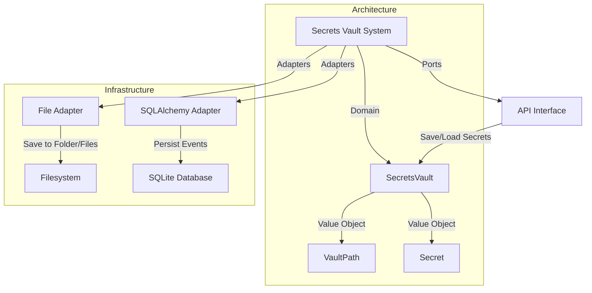
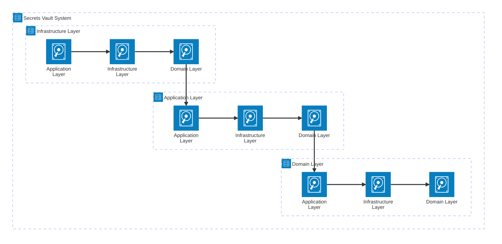

# secrets-vault
A secrets vault system inspired in Hashicorp Vault and used as example for my upcoming article on Domain-Driven Design. The system leverages a Ports and Adapters (a.k.a. Hexagonal, Onion, or Clean Architecture) together with an Event-Sourced Domain Model, and a Testing Pyramid emphasizing Unit Tests over Integration and E2E Tests (Shift-Left).

## Architecture

